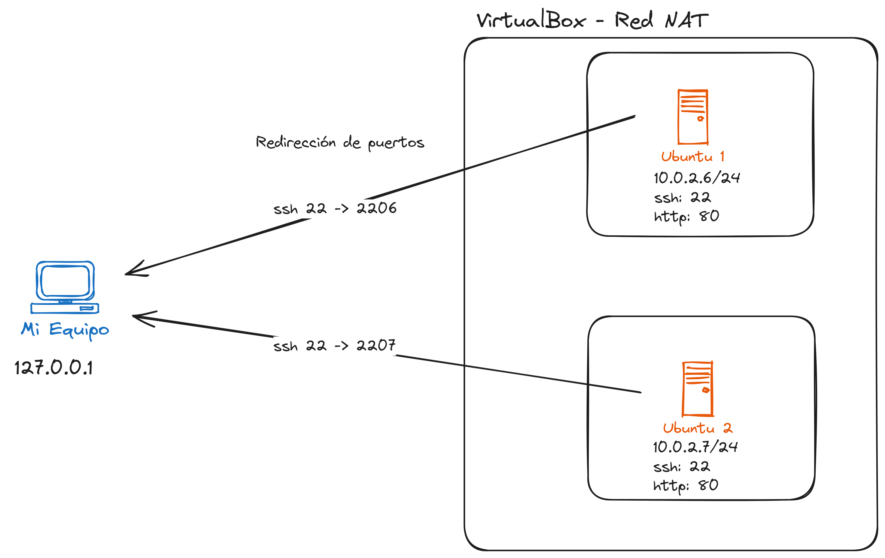
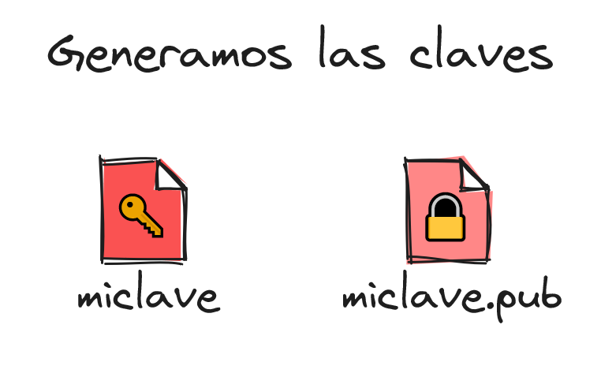
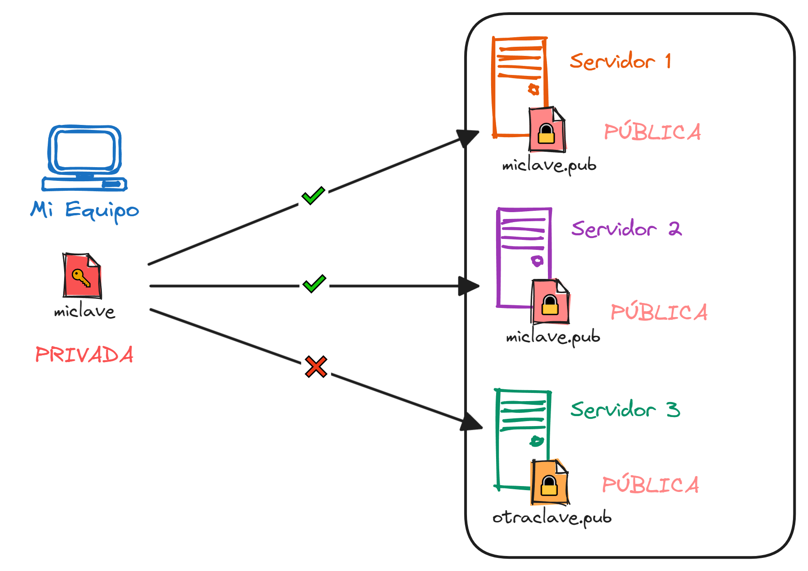
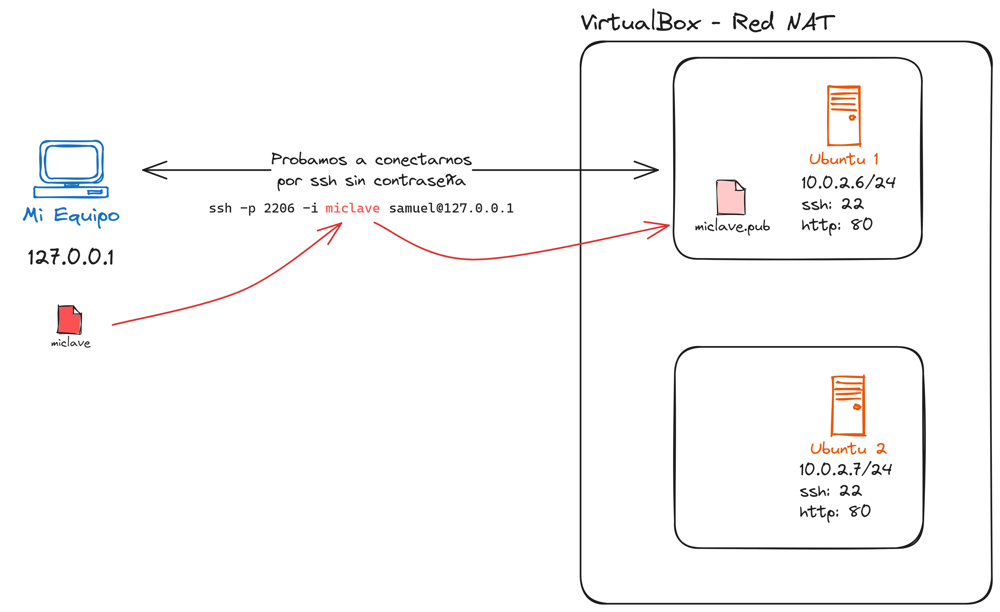

# Claves asimétricas SSH + Conexión remota

- [Estrucutura de la red](#estructura-de-la-red)
- [Generamos las claves asimétricas](#1-generamos-las-claves-asimétricas-para-ssh)
- [Añadimos la clave al servidor](#2-añadir-la-clave-pública-al-servidor)
  - [Explicación de las claves](#explicación)
  - [Windows](#🪟-windows)
  - [Linux](#🐧-linux)
- [Probamos la conexión](#3-probamos-a-conectarnos-al-servidor-sin-introducir-la-contraseña)

## Estructura de la red.

Tenemos 2 servidores virtualizados con VirtualBox conectados en una Red NAT, con la siguiente redirección de puertos.

| Nombre   | IP Anfitrión | Puerto Anfitrión | IP Host  | Puerto Host |
| -------- | ------------ | ---------------- | -------- | ----------- |
| Ubu1 SSH | 127.0.0.1    | 2206             | 10.0.2.6 | 22          |
| Ubu2 SSH | 127.0.0.1    | 2207             | 10.0.2.7 | 22          |



## 1. Generamos las claves asimétricas para ssh.

Nos situamos en <span style="color: #2679c6">**Mi Equipo**</span> es decir en el lado cliente.

Para generar el par de claves **publica y privada** utilizamos el comando `ssh-keygen`.

**⚠️ Antes de ejecutar.** Este comando te pedirá 3 datos:

1. La ruta y el nombre del archivo. → `~/.ssh/miclave`
2. La frase de seguridad, es decir, la contraseña del archivo.
   (_Se puede dejar en blanco._) → `MiContraseñaSuperSegura`
3. Comprobación para la contraseña. → `MiContraseñaSuperSegura`
   Si la hemos dejado en blanco, este campo también debe estar en blanco.

```bash
# ssh-keygen [-t dsa | ecdsa | ed25519 | rsa]
ssh-keygen -t ecdsa
> miclave
> {intro}
> {intro}
```



Esto creará el par de claves asimétricas.

- `miclave` → es la clave privada.
- `miclave.pub` → es la clave pública.

🚨**La clave privada no se comparte nunca**🚨

## 2. Añadir la clave pública al servidor.

### Explicación

Imagina que nuestras clave privada es una 🔑 y la clave pública un 🔒.



**Con una misma 🔑 podemos abrir todos los 🔒 asignados a la misma 🔑.**

Si tenemos nuestra clave publica en varios servidores podremos acceder con nuestra clave privada (podemos abrir el candado 🔓). Si nuestra clave publica no está en el servidor, no podremos acceder.

### 🪟 Windows

```powershell
# WINDOWS
# scp -P [puerto] [ruta/clave_publica.pub] [usuario]@[ip_del_servidor]:[ruta_destino/archivo]
scp -P 2206 -i .\miclave.pub [samuel@127.0.0.1](mailto:samuel@127.0.0.1):~/.ssh/
```

Eso copiara el archivo `miclave.pub` en la carpeta `~/.ssh/` en el servidor, ahora iniciamos sesión con ssh para poder añadir la clave pública en el archivo `~/.ssh/authorized_keys`

```powershell
ssh -p 2206 samuel@127.0.0.1
> {contraseña}
samuel@ubuntu1:~$ cat .ssh/miclave.pub >> .ssh/authorized_keys

# comprobamos que se ha añadido
samuel@ubuntu1:~$ cat .ssh/authorized_keys
```

### 🐧 Linux

En Linux utilizamos el comando `ssh-copy-id`, este comando añade directamente la clave al servidor pasándola como parámetro `-i miclave.pub`.

```bash
# Linux
# Si has dejado el nombre de la clave por defecto 'id_????'. Introduce el siguiente comando.
ssh-copy-id -p 2206 samuel@127.0.0.1

# ssh-copy-id -p [puerto] -i [ruta/clave_publica.pub] [usuario]@[ip_del_servidor]
ssh-copy-id -p 2206 -i ./miclave.pub samuel@127.0.0.1
```


Copiamos la clave `miclave.pub` al servidor Ubuntu 1.

### 3. Probamos a conectarnos al servidor sin introducir la contraseña.

```powershell
ssh -p 2206 samuel@127.0.0.1
```


